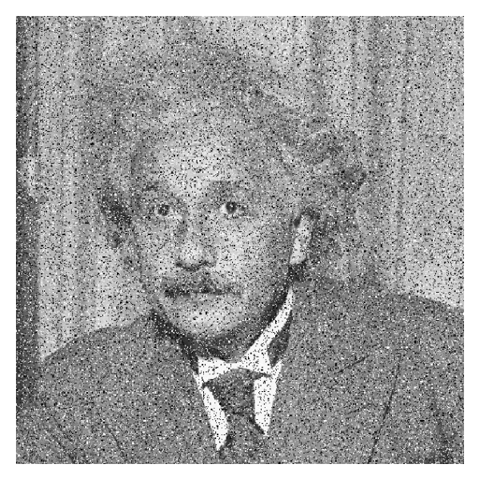
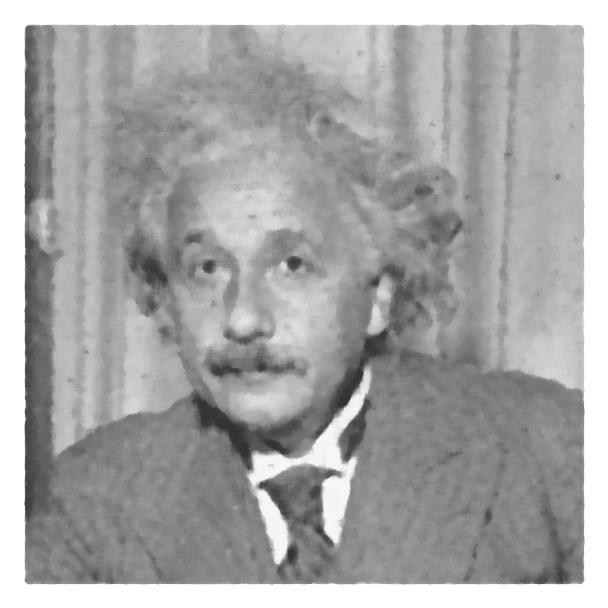
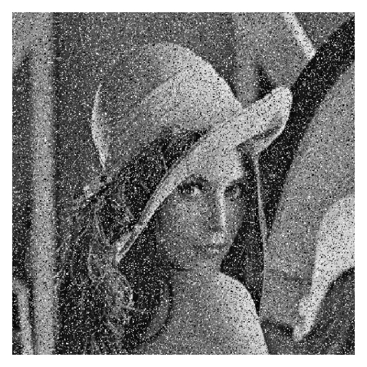
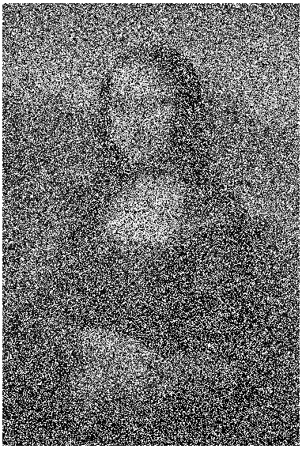

<h1>Image processing</h1>

<h3>1. Image compression: k-means clustering algorithm</h3>

Original Image (Size: 135 KB)<br><br>


Compressed images with k values:<br>
<table>
  <tr>
    <th>k value</th>
    <th>Image</th>
    <th>Size (in KB)</th>
  </tr>
  <tr>
    <td>2</td>
    <td></td>
    <td>53</td>
  </tr>
  <tr>
    <td>3</td>
    <td></td>
    <td>57</td>
  </tr>
  <tr>
    <td>10</td>
    <td></td>
    <td>92</td>
  </tr>
  <tr>
    <td>64</td>
    <td></td>
    <td>96</td>
  </tr>
</table>

```
For Windows: python.exe kmeans.py
```

<h3>2. Noise reduction</h3>
Removal of salt-and-pepper noise using a median filter (window size: 3):<br><br>
<table>
  <tr>
    <th>Corrupted image</th>
    <th>Reconstruction</th>
  </tr>
  <tr>
    <td></td>
    <td></td>
  </tr>
  <tr>
    <td></td>
    <td></td>
  </tr>
  <tr>
    <td></td>
    <td></td>
  </tr>
</table>

```
For Windows: python.exe median-filter.py <image-path>
```
