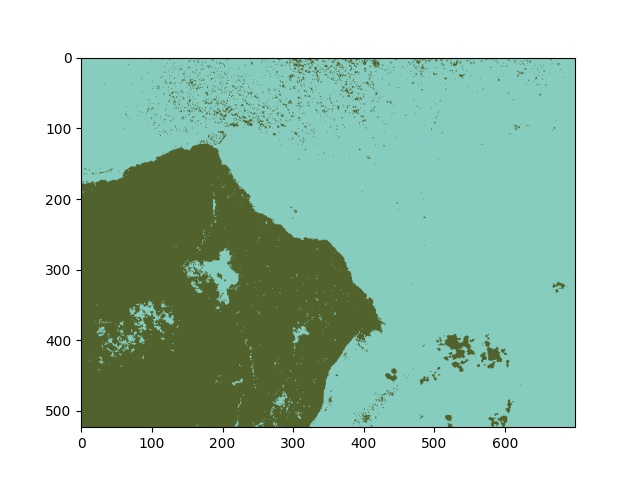
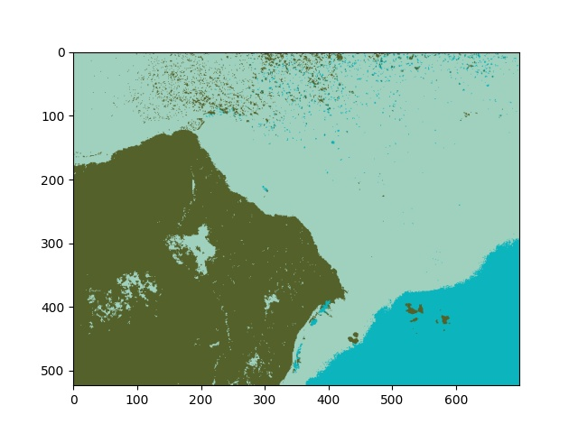
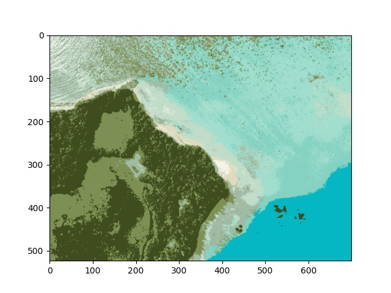
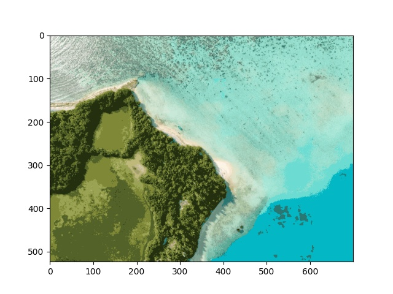

<h1>Image-processing</h1>

<h3>1. Image compression: k-means clustering algorithm</h3>

Original Image  

Compressed images with k values: 
<table>
  <tr>
    <th>k value</th>
    <th>Image</th>
  </tr>
  <tr>
    <td>2</td>
    <td></td>
  </tr>
  <tr>
    <td>3</td>
    <td></td>
  </tr>
  <tr>
    <td>10</td>
    <td></td>
  </tr>
  <tr>
    <td>64</td>
    <td></td>
  </tr>
</table>

### 2. Noise reduction
